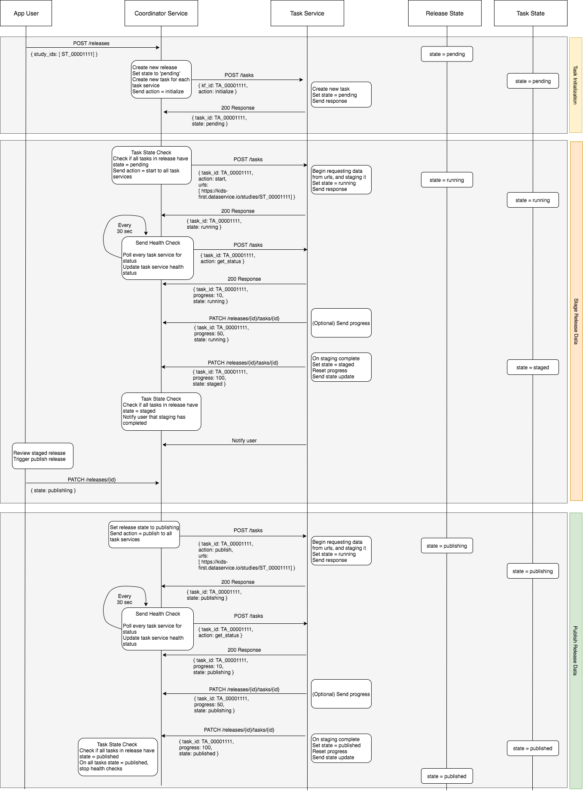
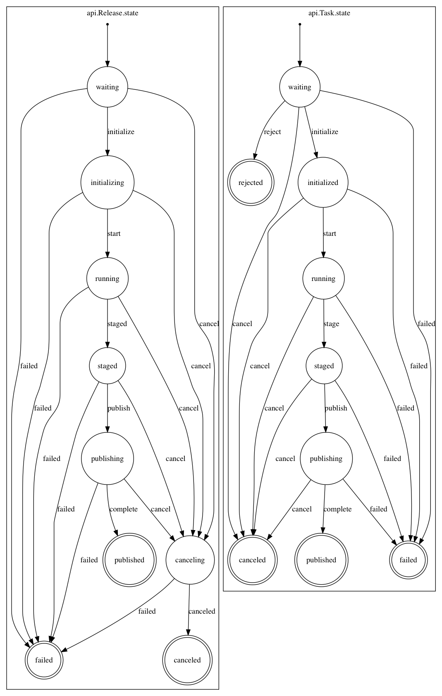

<p align="center">
  
</p>
<p align="center">
  <a href="https://github.com/kids-first/kf-api-release-coordinator/blob/master/LICENSE"></a>
  <a href="https://kids-first.github.io/kf-api-release-coordinator/docs/coordinator.html"></a>
  <a href="https://circleci.com/gh/kids-first/kf-api-release-coordinator"></a>
  <a href="https://app.codacy.com/app/kids-first/kf-api-release-coordinator/dashboard"></a>
</p>

Kids First Release Coordinator
==============================

The Kids First Release Coordinator brings different services in the Kids First ecosystem together to release data in a synchronized manner.


## Development Quick Start

### Developing against the coordinator

To develop task services against the coordinator, use the included
docker-compose.yml to get a fully functional Coordinator API:

```
git clone https://github.com/kids-first/kf-api-release-coordinator
cd kf-api-release-coordinator
docker-compose up
```

This will stand up a couple different services:
- The Coordinator API on port `5000`
- A task worker to process different release jobs
- A redis instance to manage the work queue
- A postgres database to store information about releases, tasks, and services

To allow tasks to communicate with the Coordinator, they will need to be
run in a container that is linked to the Coordinator's network.

```
docker run --name=task --net=kfapireleasecoordinator_default --rm --link kfapireleasecoordinator_coordinator_1:coordinator example-task:latest
```

This will allow the task running in the `task` container to communicate with
the Coordinator API with the `coordinator` hostname and the Coordinator to
communicate with the task using the `task` hostname.


### Developing the Coordinator API

To get started developing the Coordinator API itself, clone the repo,
install dependencies, start a postgres database, and run the django app.

#### Clone and install Python dependencies

```
git clone https://github.com/kids-first/kf-api-release-coordinator
cd kf-api-release-coordinator
virtualenv -p python3 venv
source venv/bin/activate
pip install -r dev-requirements.txt
pip install -r requirements.txt
```

#### Start a Postgres Database

Starting a Postgres Docker container:

```
docker run --name coordinator-pg -p 5432:5432 postgres:9.5
docker exec coordinator-pg psql -U postgres -c "CREATE DATABASE dev;"
```

#### Start redis and workers

Redis is used for queueing messages for workers. If you are developing a
feature that requires task services to run, you will need to have a running
redis instance and a worker to process the queue:

```
docker run -d --name coordinator-redis -p 6379:6379 redis:latest
```

And start a worker (only necessary if you need to process tasks):

```
python manage.py rqworker default
```

Note that you will have to restart the worker if your task code changes.

#### Run the Django app

You may configure the Postgres connection settings by setting the following
env variables:

- `PG_NAME`
- `PG_USER`
- `PG_PASS`
- `PG_HOST`
- `PG_PORT`

And the Redis connection settings with:

- `REDIS_HOST`
- `REDIS_PORT`

```
# migrate the database first
export PG_NAME=dev
./manage.py migrate
./manage.py runserver
```


## Background
There are several services which drive end user apps in the Kids First ecosystem. These services all consume Kids First data and must stay in sync with one and other in terms of the state of their data. One service cannot have more up to date data then another service. Additionally, there may be other services outside of the Kids First ecosystem that are interested in staying in sync with the latest Kids First data as new releases get published.

The Kids First Release Coordinator service ensures data consistency among Kids First data release consumers and is responsible for orchestrating the synchronization and publishing of a data release. Data synchronization is the process in which all data release consumers retrieve the latest release data and stage or store it in an environment/state where it is not yet accessible to the public. The publishing of a data release is the process of a data release consumer making the staged data accessible to the public.

## Coordinator and Task Services
The Kids First Release Coordinator Service consists of two types of services: The Coordinator Service and Task Services.

### Task Services
In order for a Kids First data release consumer to stay up to date with data releases, it must implement a Task Service. A task service should implement the endpoints in the Kids First Release Coordinator Task Service specification in order for the release coordinator to properly invoke tasks.

[View the spec](https://kids-first.github.io/kf-api-release-coordinator/docs/task.html)

### Coordinator Service
The task service endpoints expose a common interface for the Coordinator Service to communicate with. Through these endpoints, the Coordinator Service instructs the task services to perform a sequence of operations that carry out the steps necessary for a data release to be published.

The Release Coordinator responds to requests to release data by orchestrating
necessary tasks to execute and sync operations needed for a data release.

[View the spec](https://kids-first.github.io/kf-api-release-coordinator/docs/coordinator.html)


Sequence of Operations (Success Case)
---------------------------------------------------
The diagram below illustrates the sequence of operations between the Coordinator service and a Task service for a
successful release publish.

Publishing a release consists of 3 steps:

1. Task initialization
    * The coordinator service will send a POST with `action=initialize` to each task service's /tasks endpoint.
    * The coordinator service will wait until all task services have responded with `state=pending` and then send the next action
2. Staging of release data
    * The coordinator will send a POST with `action=start` along with the list of retrieval urls to each task service's /tasks endpoint.
    * The task services will begin requesting release data from the given urls and staging the data. The task services will set `state=running` during this step.
    * The coordinator service will begin polling each task service for status/health via a POST with `action=get_status`. Any non-200 response will result in a failed release publish. If this happens the task service will send a POST to all task services with `action=cancel`.
    * The coordinator service will wait until all task services have responded with `state=staged` and then send the next action
3. Publishing of release data
    * Upon receiving a publish request from the user, the coordinator will send a POST with `action=publish` to each of the registered endpoints.
    * The task services will begin publishing the staged release data. The task services will set `state=publishing` during this step.
    * The coordinator service will begin polling each task service for status/health via a POST with `action=get_status`. Any non-200 response will result in a failed release publish. If this happens the task service will send a POST to all task services with `action=cancel`.
    * Once all task services have responded with `state=published`, the publish is complete.




Modes of Failure and Cancelation
---------------------------------------------------



A task or release may fail or be canceled at any stage.
The difference between the two is expected vs unexpected behavior.
Aside from this difference, the outcome of both actions should be identical.
The task or release that has been canceled or failed should result in all work to stop on the relevant release and all tasks related to it.

### Failure by rejection

The first action the coordinator requests from task services is to `initialize`.
If a task service does not respond with a `200` code, it will be assumed that it is not ready for work and the task will be set as `rejected`.
A `rejected` task will result with a `failed` release.

### Unexpected failure

A release will result in failure whenever one of its tasks reports itself as having failed, the coordinator finds the task in a `failed` state when polling for status, or when the coordinator is unable to get the status of the task from the task service.
Once one of these failures have been identified, the coordinator will attempt to cancel all tasks and result in a `failed` state.

### Cancelation by user

When a user requests a release be canceled, the coordinator will issue `cancel` actions to all tasks in the release.
The final state of the release and all tasks in it will be `canceled`

### Cancelation on failure

When the coordinator identifies one of its tasks as having failed, it will issue `cancel` actions to all other tasks in the release.
The final state of the release will be `failed` as well as the task that caused the failure.
All other tasks will end in a `canceled` state.

### Cancelation on timeout

Releases and tasks may timeout if they remain in the same state for too long.
`TASK_TIMEOUT` and `RELEASE_TIMEOUT` in the `settings.py` set these timeouts.
The coordinator will periodically poll task services for tasks that are in the release process.
If a task has been in the `waiting`, `running`, or `publishing` state longer than `TASK_TIMEOUT` allows, the release the task belongs to will be canceled.
If a release has been in the `initializing`, `running`, `publishing`, or `canceling` state for longer than `RELEASE_TIMEOUT` allows, the release will be canceled.


### Cancelation by task

Although not suggested, a task may cancel a release by reporting itself as `canceled`.
